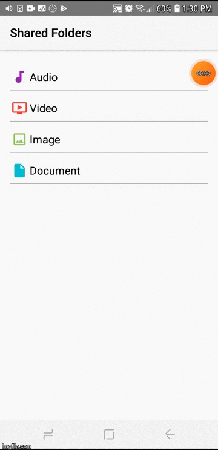

# Media-File-Manager
A simple file manager app used for accessing shared folders 

# Preview

# Used Components
- Architecture : MVVM
- Android SDK components: Recyclerview, Options Menu, Recyclerview adapter, Viewmodel, MediaStore API, File, AlertDialog Fragment
- 3rd Party Libraries: Glide
